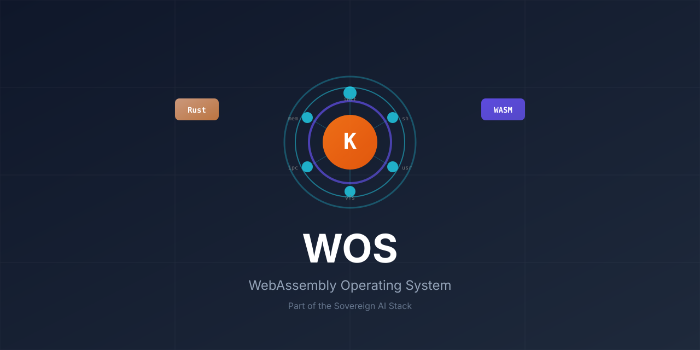

<div align="center">

<p align="center">
  
</p>

<p align="center">
  <b>Educational microkernel OS in pure Rust — runs entirely in your browser</b>
</p>

<p align="center">
  <a href="https://interactive.paiml.com/wos/"></a>
  <a href="LICENSE"></a>
</p>

<p align="center">
  <a href="https://interactive.paiml.com/wos/">Live Demo</a> •
  <a href="#quick-start">Quick Start</a> •
  <a href="#architecture">Architecture</a> •
  <a href="https://github.com/paiml/batuta">Sovereign AI Stack</a>
</p>

</div>

---

## Overview

**WOS** (WebAssembly Operating System) is an educational microkernel that demonstrates fundamental OS concepts — processes, memory management, file systems, IPC — in a safe, deterministic environment that runs directly in any modern browser.

Part of the [Sovereign AI Stack](https://github.com/paiml/batuta), WOS serves as the runtime foundation for browser-based ML inference and educational computing environments.

### Key Features

- **100% Safe Rust** — `#![forbid(unsafe_code)]` enforced at crate level
- **Pure WASM** — No plugins, runs in any modern browser
- **Functional Design** — Immutable state transitions, deterministic execution
- **Time-Travel Debugging** — Bidirectional execution replay with full snapshots
- **Extreme TDD** — 94%+ coverage, 98.5% mutation score

## Quick Start

```bash
# Install WASM target
rustup target add wasm32-unknown-unknown

# Build and serve
make wasm && make serve

# Open http://localhost:8000
```

### Try the Shell

```bash
help              # Available commands
ps                # List processes
ls /proc          # Process filesystem
cat /proc/1/status  # View init process
echo $?           # Last exit code
vim hello.txt     # Modal editor
```

## Architecture

WOS implements a classic microkernel with minimal trusted computing base:

```
┌─────────────────────────────────────────────────────────────┐
│                     Browser (WASM Runtime)                  │
├─────────────────────────────────────────────────────────────┤
│  Userspace                                                  │
│  ┌─────────┐ ┌─────────┐ ┌─────────┐ ┌─────────┐          │
│  │  init   │ │  shell  │ │   vim   │ │ programs│          │
│  │ (PID 1) │ │         │ │         │ │ ls,cat..│          │
│  └────┬────┘ └────┬────┘ └────┬────┘ └────┬────┘          │
├───────┴──────────┴──────────┴──────────┴──────────────────┤
│                     System Call Interface                   │
├─────────────────────────────────────────────────────────────┤
│  Microkernel (~2000 lines)                                  │
│  ┌──────────┐ ┌──────────┐ ┌──────────┐ ┌──────────┐      │
│  │Scheduler │ │  Memory  │ │   VFS    │ │   IPC    │      │
│  │Round-Robin│ │  Manager │ │  ProcFS  │ │ Messages │      │
│  └──────────┘ └──────────┘ └──────────┘ └──────────┘      │
└─────────────────────────────────────────────────────────────┘
```

### Pure Functional Syscalls

All operations follow the functional pattern — state flows in, new state flows out:

```rust
pub fn dispatch_syscall(
    state: KernelState,
    syscall: SystemCall,
    pid: ProcessId,
) -> Result<(KernelState, SyscallOutput), KernelError>
```

No global state. No side effects. Fully deterministic.

### System Calls

| Category | Syscalls |
|----------|----------|
| **Process** | `fork`, `exec`, `exit`, `waitpid`, `getpid`, `kill` |
| **File I/O** | `open`, `close`, `read`, `write` |
| **Memory** | `mmap`, `munmap` |
| **Signals** | `sigaction`, `sigprocmask` |
| **IPC** | `send`, `recv` |

## Sovereign AI Stack Integration

WOS is a component of the [Sovereign AI Stack](https://github.com/paiml/batuta), providing browser-based runtime capabilities:

```
┌─────────────────────────────────────────────────────────────┐
│                    batuta (Orchestration)                   │
├─────────────────────────────────────────────────────────────┤
│     realizar          │           pacha                     │
│   (Inference)         │      (Model Registry)               │
├───────────────────────┴─────────────────────────────────────┤
│                    aprender (ML Algorithms)                 │
├─────────────────────────────────────────────────────────────┤
│      trueno           │          WOS                        │
│   (SIMD Compute)      │   (Browser Runtime)                 │
└─────────────────────────────────────────────────────────────┘
```

### Stack Components

| Component | Purpose | Link |
|-----------|---------|------|
| **batuta** | Stack orchestration | [crates.io/crates/batuta](https://crates.io/crates/batuta) |
| **aprender** | ML algorithms | [crates.io/crates/aprender](https://crates.io/crates/aprender) |
| **trueno** | SIMD/GPU compute | [crates.io/crates/trueno](https://crates.io/crates/trueno) |
| **WOS** | Browser runtime | [interactive.paiml.com/wos](https://interactive.paiml.com/wos/) |

## Quality Compliance

WOS adheres to strict quality standards enforced by the PAIML toolchain.

### PMAT Comply

Verified compliance with [pmat](https://crates.io/crates/pmat) quality standards:

```bash
pmat comply check            # ✓ COMPLIANT
pmat analyze tdg             # TDG Grade: A+
pmat quality-gate --strict   # All gates pass
```

**Compliance Status:**
```
✓ Version Currency: v2.213.1
✓ Config Files: All present
✓ Git Hooks: PMAT enforcement installed
✓ Quality Thresholds: Configured
✓ Deprecated Features: None
```

**Metrics:** TDG A+ (99.3/100) • 94% coverage • 98.5% mutation score

### Probar Comply

**Status: IN PROGRESS** — [WOS-PROBAR-001](docs/tickets/WOS-PROBAR-001-zero-javascript-compliance.yaml)

| Requirement | Status | Notes |
|-------------|--------|-------|
| Zero JavaScript | ❌ | 5,051 lines to migrate |
| jugar-probar | ✓ | Added as dev-dependency |
| GUI Coverage | ⏳ | Tracking ticket created |
| probador CLI | ⏳ | Migration planned |

**Current Test Matrix:**
| Type | Count | Coverage |
|------|-------|----------|
| Unit Tests | 3,036 Rust + 43 Frontend | 94.11% |
| Property Tests | 22,000+ cases | Invariant validation |
| E2E Tests | 211 × 5 browsers | User workflows |
| Mutation Tests | 411 mutants | 98.5% killed |

**Migration Path**: See [WOS-PROBAR-001](docs/tickets/WOS-PROBAR-001-zero-javascript-compliance.yaml) for the full zero-JavaScript compliance plan.

### Quality Gates

All commits must pass:

```bash
make quality                # Fast checks (<30s)
make quality-complete       # Full validation
```

## Development

### Prerequisites

- Rust 1.70+ with `wasm32-unknown-unknown` target
- [ruchy](https://crates.io/crates/ruchy) — Development server with hot reload

### Commands

```bash
make build          # Build all crates
make wasm           # Build WASM binary
make serve          # Start dev server (ruchy)
make test           # Run Rust tests
make e2e            # Run E2E tests
make coverage       # Generate coverage report
make mutants        # Run mutation testing
```

### Project Structure

```
wos/
├── kernel/         # Microkernel (~2000 lines)
│   ├── scheduler.rs    # Round-robin scheduling
│   ├── memory.rs       # Virtual memory
│   ├── syscall.rs      # System calls
│   └── trace.rs        # Time-travel debugging
├── shared/         # Shared types
│   ├── vfs.rs          # Virtual filesystem
│   ├── parser.rs       # Command parsing
│   └── pipeline.rs     # Pipeline execution
├── userspace/      # User programs
│   ├── shell.rs        # Interactive shell
│   ├── programs.rs     # ls, cat, ps, etc.
│   └── vim/            # Modal editor
├── wos/            # WASM bindings
└── dist/wos/       # Browser frontend
```

## Educational Use

WOS teaches OS concepts through hands-on exploration:

| Concept | WOS Implementation |
|---------|-------------------|
| **Process Management** | `fork`/`exec`, process trees, PID namespace |
| **Memory Management** | Virtual memory, page tables, R/W/X permissions |
| **File Systems** | VFS abstraction, ProcFS, file descriptors |
| **IPC** | Message passing, synchronous/async patterns |
| **Scheduling** | Round-robin, fairness guarantees |
| **Time-Travel Debug** | State snapshots, bidirectional replay |

### Why WebAssembly?

- **Safety**: WASM sandbox prevents crashes and corruption
- **Accessibility**: Runs in any browser, zero installation
- **Debuggability**: Full state inspection at any execution point
- **Determinism**: Reproducible tests, predictable behavior

## Contributing

1. Maintain `#![forbid(unsafe_code)]`
2. Add tests for all new functionality (85%+ coverage target)
3. Run `make quality` before committing
4. Follow conventional commit format

## License

MIT License — see [LICENSE](LICENSE) for details.

## Links

- **Live Demo**: [interactive.paiml.com/wos](https://interactive.paiml.com/wos/)
- **Sovereign AI Stack**: [github.com/paiml/batuta](https://github.com/paiml/batuta)
- **PMAT Toolkit**: [crates.io/crates/pmat](https://crates.io/crates/pmat)

---

<div align="center">

**WOS** — Educational OS for the Sovereign AI Stack

[Live Demo](https://interactive.paiml.com/wos/) • [Documentation](CLAUDE.md) • [Issues](https://github.com/paiml/wos/issues)

</div>
